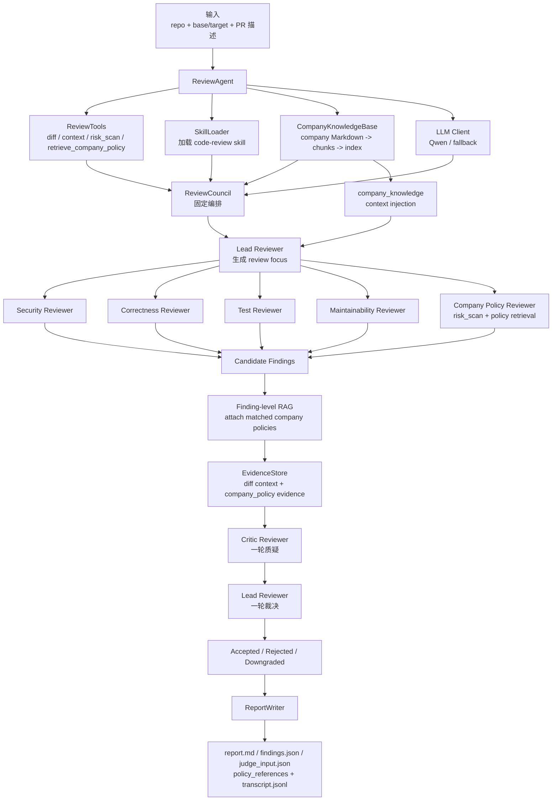
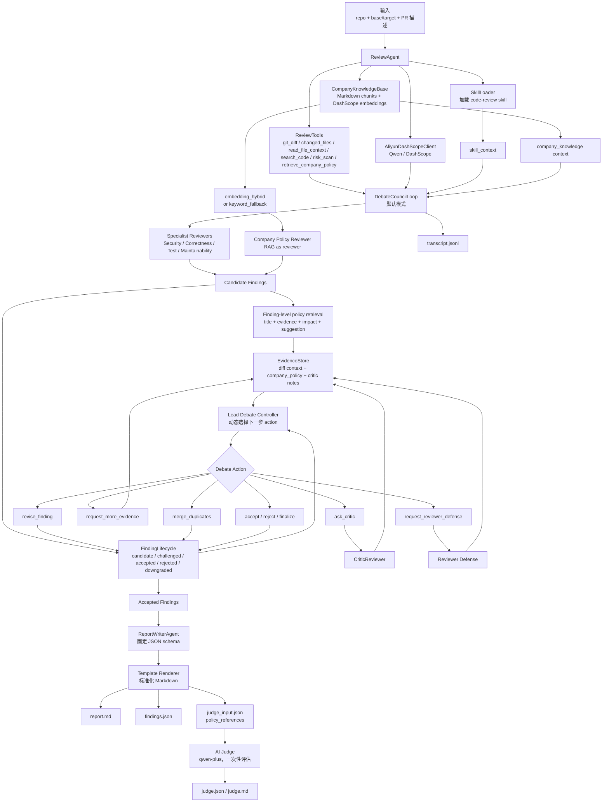
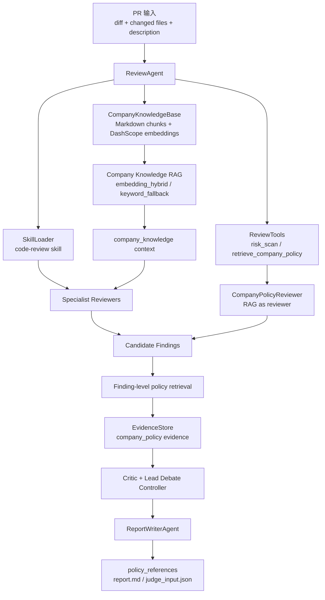

# PR Review Agent Council

面向中文用户的 **Debate Council PR Review Agent**。项目基于 `learn-claude-code` 的 Agent 工程思路改造，用 Python + Aliyun DashScope/Qwen 实现一个只读 PR Review Agent：读取 Git diff 和 PR 描述，组织多个 reviewer 生成候选问题，再通过 debate loop 对 finding 进行质疑、补证、反驳、合并和裁决，最后输出标准化报告，并可用 AI Judge 做质量评估。

当前默认模式是 `--mode debate`。旧的 `--mode council` 仍然保留，作为固定 workflow baseline，方便复现、教学和效果对比。

本项目适合用来学习：

- 多 Agent 协作审查代码。
- Tool Calling 和只读代码工具设计。
- Skill Loading 如何把审查规范注入 prompt。
- Debate Loop 如何区别于固定 workflow。
- ReportWriterAgent 如何把 LLM 输出约束为固定 JSON。
- AI Judge 如何作为 review quality 的辅助评价指标。

## 功能概览

- **Debate Council 默认审查模式**：以 `--mode debate` 运行，多名 reviewer 先提出候选 finding，再由 Lead Debate Controller 动态决定质疑、补证、反驳、合并、接受或拒绝。
- **多 Agent 分工协作**：内置 Security、Correctness、Test、Maintainability、Critic、Lead、ReportWriter、Judge 等角色，把 PR Review 拆成覆盖、质检、裁决和评估多个阶段。
- **动态 Debate Loop**：不同于固定 workflow，系统会围绕每个 finding 的证据质量和误报风险进行多轮处理，重点提升有效问题质量，而不是单纯增加问题数量。
- **只读 Tool Calling**：通过 `git_diff`、`changed_files`、`read_file_context`、`search_code`、`secret_scan`、受控 `run_tests` 等工具观察仓库，避免 Agent 凭空猜测。
- **Skill Loading**：从 `skills/code-review/SKILL.md` 加载审查规范、严重级别定义和 finding schema，并注入 reviewer、critic、lead、report writer 的 prompt。
- **FindingLifecycle + EvidenceStore**：记录 candidate、challenged、accepted、rejected、downgraded 等状态，并为每个 finding 绑定 diff 行、文件上下文、critic notes 和裁决理由。
- **标准化 ReportWriterAgent**：LLM 只能输出固定 JSON schema，Markdown 由程序模板渲染，减少文笔差异对报告质量和 AI Judge 评分的影响。
- **AI Judge 质量评估**：独立命令触发，默认使用 `qwen-plus`，按 critical issue coverage、evidence quality、severity accuracy、duplicate/noise control、actionability、report clarity 等维度评分。
- **可观测 Transcript**：所有 action、observation、message、evidence、resolution 都写入 JSONL trace，便于复盘、调试和面试展示。
- **Council Baseline 保留**：`--mode council` 作为旧版固定流程 baseline，方便复现新旧模式对比。

## 新旧模式流程图

旧版 `--mode council` 是固定委员会 workflow，适合作为 baseline 理解：



当前默认 `--mode debate` 保留 reviewer 团队，但把 finding 质量控制升级为动态 debate loop：



## 安装与复现

### 1. 克隆并安装依赖

```bash
cd pr-review-agent-council
python -m venv .venv
```

Windows PowerShell:

```powershell
.\.venv\Scripts\Activate.ps1
python -m pip install -U pip
python -m pip install -r requirements.txt
```

macOS / Linux:

```bash
source .venv/bin/activate
python -m pip install -U pip
python -m pip install -r requirements.txt
```

### 2. 配置 DashScope API Key

复制 `.env.example` 为 `.env`，然后填入自己的 key：

```text
DASHSCOPE_API_KEY=your_dashscope_api_key
```

程序启动时会读取 `.env` 中的 `DASHSCOPE_API_KEY`。

如果只想本地体验，不调用大模型，可以运行时加：

```bash
--llm-provider none
```

### 3. 运行测试

```bash
python -m pytest -p no:cacheprovider
```

当前测试覆盖 debate loop、工具调用、report writer、AI Judge fallback、council/simple 兼容逻辑等。

项目运行代码主要使用 Python 标准库；`requirements.txt` 中的 `pytest` 用于复现测试和验证。

## 快速运行

### 默认：Debate Council Agent

```bash
python agents/review_agent.py --repo . --base HEAD~1 --target HEAD --pr-description docs/demo-pr.md --language zh
```

这等价于：

```bash
python agents/review_agent.py --repo . --base HEAD~1 --target HEAD --pr-description docs/demo-pr.md --language zh --mode debate
```

### 旧模式：Council Baseline

```bash
python agents/review_agent.py --repo . --base HEAD~1 --target HEAD --pr-description docs/demo-pr.md --language zh --mode council
```

这个模式保留固定流程：多个 reviewer 先审查，critic 再质疑，lead reviewer 再裁决。它适合作为 baseline，用来解释为什么后来升级为 debate loop。

### 本地兜底：Simple

```bash
python agents/review_agent.py --repo . --base HEAD~1 --target HEAD --pr-description docs/demo-pr.md --language zh --mode simple --llm-provider none
```

## 使用 Demo PR 复现

如果你的当前 `HEAD~1..HEAD` 不是 demo 代码，可以先找到项目内置 demo commit：

```bash
git log --format=%H --grep "Demo PR with payment risks" --max-count=1
```

假设输出为 `<demo_commit>`，则运行：

```bash
python agents/review_agent.py --repo . --base <demo_commit>^ --target <demo_commit> --pr-description docs/demo-pr.md --language zh --mode debate
```

旧 council 对照：

```bash
python agents/review_agent.py --repo . --base <demo_commit>^ --target <demo_commit> --pr-description docs/demo-pr.md --language zh --mode council
```

## AI Judge 评估

普通 review 不会自动调用 AI Judge。先运行一次 review，生成 `.review-agent/judge_input.json`，再显式执行：

```bash
python agents/review_agent.py --judge-report .review-agent/judge_input.json --repo . --base HEAD~1 --target HEAD --pr-description docs/demo-pr.md
```

默认 judge model 是 `qwen-plus`，也可以指定：

```bash
python agents/review_agent.py --judge-report .review-agent/judge_input.json --repo . --base HEAD~1 --target HEAD --pr-description docs/demo-pr.md --judge-model qwen-plus
```

AI Judge 不是 ground truth。它的定位是一个自动化 evaluation proxy：在固定输入、固定 JSON schema、固定 rubric、固定模型下，对不同 agent 策略做可追踪的相对比较。更严谨的评估还应该结合人工标注、多次采样、多模型投票和真实 PR 反馈。

## 主要参数

```text
--repo                 仓库路径，默认当前目录
--base                 对比基线，例如 HEAD~1、main 或某个 commit
--target               对比目标，例如 HEAD、feature branch 或某个 commit
--pr-description       PR 描述文件，可为空
--language             输出语言，zh 或 en
--mode                 debate、council 或 simple，默认 debate
--debate-max-actions   Debate loop 最大 action 数，默认 12
--critic-pass          是否执行 critic review，默认 true
--test-command         允许 agent 调用的测试命令；未传入时 run_tests 会受控拒绝
--llm-provider         aliyun 或 none
--llm-model            Review 使用的 DashScope 模型，默认 qwen-turbo-latest
--llm-base-url         OpenAI-compatible DashScope base URL
--judge-report         对指定 judge_input.json 运行 AI Judge
--judge-model          Judge 使用的 DashScope 模型，默认 qwen-plus
```

## 输出文件

```text
.review-agent/report.md              # 标准化 Markdown 审查报告
.review-agent/findings.json          # 结构化 findings 和生命周期信息
.review-agent/judge_input.json       # 给 AI Judge 使用的标准化输入
.review-agent/transcript.jsonl       # Review 过程 trace
.review-agent/judge.json             # AI Judge JSON 评分
.review-agent/judge.md               # AI Judge Markdown 评分报告
.review-agent/judge-transcript.jsonl # Judge 调用 trace
```

## Debate 与 Council 的区别

| 维度 | `--mode council` | `--mode debate` |
|---|---|---|
| 定位 | 旧版固定 workflow baseline | 当前默认多 Agent debate 模式 |
| Reviewer 分工 | Security / Correctness / Test / Maintainability | 保留同样 reviewer 分工 |
| 控制方式 | 程序固定执行 reviewer -> critic -> lead -> report | Lead Debate Controller 动态选择 action |
| Finding 质量控制 | 一轮 critic + 一轮 lead resolution | 多轮质疑、补证、反驳、合并、接受、拒绝 |
| 重复项处理 | 容易出现多个 reviewer 报同一问题 | 支持 `merge_duplicates` |
| 报告 | 标准化输出 | 标准化输出，并可由 ReportWriterAgent 进一步整理 |
| 适合用途 | baseline 对照、教学解释 | 默认推荐、项目展示、效果评估 |

核心思想：PR review 不应该用“发现问题数量”作为主要指标。更合理的指标是关键风险覆盖、证据质量、严重级别准确性、重复/噪音控制、修复建议可执行性和报告清晰度。

## Demo 审查质量对比

以下结果来自内置 `payment_risk.py` demo，在相同 diff 和 PR 描述下分别运行 `--mode council` 与 `--mode debate`，再用相同的 `qwen-plus` AI Judge 对标准化 `judge_input.json` 评分。这个分数不是绝对真理，而是用于横向比较两种 agent 策略的 evaluation proxy。

| 指标 | `council` | `debate` | 变化 |
|---|---:|---:|---:|
| AI Judge 总分 | 72 | 92 | +20 |
| critical issue coverage | 100 | 100 | 持平 |
| evidence quality | 85 | 95 | +10 |
| severity accuracy | 70 | 90 | +20 |
| duplicate/noise control | 40 | 98 | +58 |
| actionability | 90 | 96 | +6 |
| report clarity | 80 | 85 | +5 |

对比结果说明：新版 `debate` 并不是单纯追求更多 findings，而是通过 critic、补证、合并重复项和标准化报告，提升证据质量、严重级别判断和重复/噪音控制。

示例输出已整理在 [docs/demo-results](docs/demo-results/README.md)，包含脱敏后的 council/debate 报告和 AI Judge 评分结果。

## 项目结构

```text
agents/review_agent.py              # 主实现：CLI、tools、LLM client、agent loop、report、judge
skills/code-review/SKILL.md         # code review skill，注入审查规范和 finding schema
docs/demo-pr.md                     # Demo PR 描述
docs/demo-results/                  # 脱敏后的 demo 报告和 AI Judge 评分结果
docs/中文教程-Agent简历面试.md       # 中文教程、简历写法、面试问答
demo/pr-fixture/payment_risk.py     # Demo 风险代码
tests/test_review_agent.py          # 单元测试与集成测试
requirements.txt                    # 运行与测试依赖
.env.example                        # 环境变量模板
```

## 和 learn-claude-code / Claude Code 思路的关系

这个项目不是 Claude Code 本身，也没有复制 Claude Code 内部实现。它是基于 `learn-claude-code` 的学习思路做的 PR Review Agent 项目，借鉴并工程化了以下 Agent 技术：

- **Tool Calling**：Agent 只能通过受控只读工具观察仓库，如 `git_diff`、`changed_files`、`read_file_context`、`search_code`、`secret_scan`、受控 `run_tests`。
- **Skill Loading**：从 `skills/code-review/SKILL.md` 加载审查规范和 finding schema，注入到 reviewer、critic、lead、report writer 的 prompt。
- **Multi-Agent System**：Security、Correctness、Test、Maintainability、Critic、Lead、ReportWriter、Judge 以不同角色协作。
- **Debate Loop**：不是固定流程结束，而是围绕 finding 进行动态 action 选择。
- **Todo / Lifecycle 思想**：通过 FindingLifecycle 管理 candidate、challenged、accepted、rejected、downgraded 状态。
- **Structured Output**：review、debate action、report、judge 都要求 JSON 输出，程序负责校验与模板渲染。
- **Observability**：用 JSONL transcript 记录每一步，便于调试、复盘和面试展示。


## Company Knowledge RAG

新版本新增 **公司知识对齐 RAG**，用于把通用 PR review 能力对齐到特定公司的编码规范、安全基线、支付规范、测试要求和历史缺陷案例。

默认知识库位于：

```text
knowledge/company/
  security_baseline.md
  payment_review_policy.md
  testing_policy.md
  incident_cases.md
```

RAG 现在接在三层：

- **上下文层**：review 开始前检索相关公司规范，注入 `<company_knowledge>`。
- **证据层**：每个 candidate finding 生成后检索相关规范，写入 `EvidenceStore`，source 为 `company_policy`。
- **发现层**：新增 `company-policy-reviewer`，基于 `risk_scan + retrieve_company_policy` 主动发现公司规范违规。



常用命令：

```bash
# 默认启用公司知识 RAG
python agents/review_agent.py --repo . --base HEAD~1 --target HEAD --pr-description docs/demo-pr.md --language zh --mode debate

# 指定知识库目录
python agents/review_agent.py --repo . --base HEAD~1 --target HEAD --company-knowledge-dir knowledge/company

# 关闭 RAG 做对比实验
python agents/review_agent.py --repo . --base HEAD~1 --target HEAD --disable-company-rag
```

有 `DASHSCOPE_API_KEY` 时使用 DashScope OpenAI-compatible embeddings，默认模型 `text-embedding-v4`、维度 `1024`；无 key 或请求失败时自动退化到 `keyword_fallback`，不会阻塞本地 demo。

详细设计见 [docs/company-rag.md](docs/company-rag.md)，demo 快照见 [docs/demo-results/company-rag-report.md](docs/demo-results/company-rag-report.md)