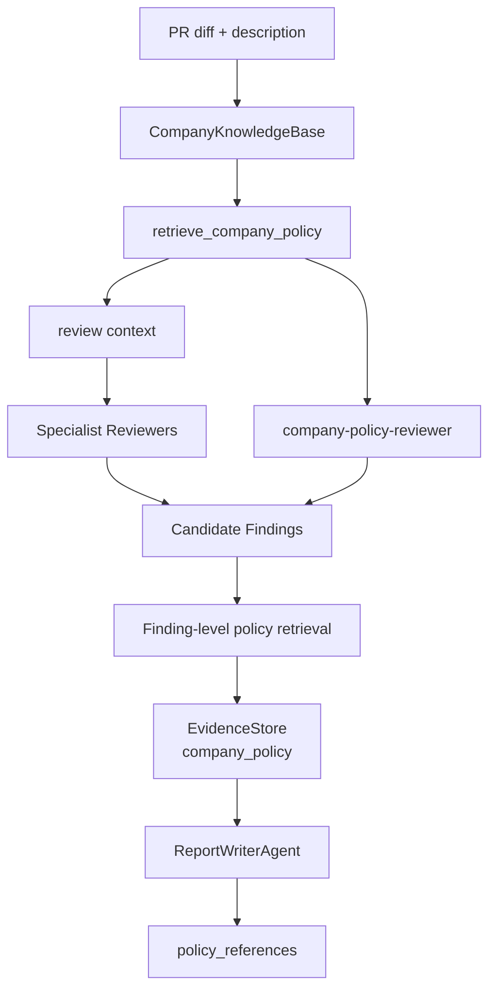

# Demo Result: Company Knowledge RAG Snapshot

This is a sanitized snapshot from the built-in `payment_risk.py` PR fixture after adding Company Knowledge RAG.

- Mode: `debate`
- LLM provider: `none` demo fallback
- Company RAG: enabled
- Embedding status: `keyword_fallback` in local demo without `DASHSCOPE_API_KEY`
- Added reviewer: `company-policy-reviewer`
- Evidence source: `company_policy`

The goal of this snapshot is different from the original council/debate comparison. The original comparison asks whether debate improves review quality over a fixed workflow. This snapshot asks whether review findings can be tied back to company-specific policies and historical incidents.

## RAG Integration Points

## Representative Policy-Backed Findings

### 1. Hardcoded secrets and token exposure

- Proposed by: `security-reviewer`
- Evidence source: demo code contains token-like and webhook-secret-like values.
- Company policy references:
  - `security_baseline:secrets-and-tokens`
  - `payment_review_policy:high-risk-country-handling`
- Why it matters: the finding is no longer only a generic secret-management issue; it is tied to the company's rule that API tokens, webhook secrets, passwords, private keys, and signing secrets must not appear in source, fixtures, logs, CI output, or exception messages.

### 2. SQL and command execution risk

- Proposed by: `company-policy-reviewer`
- Evidence source: `risk_scan` identifies f-string SQL and request-derived values reaching `shell=True`.
- Company policy references:
  - `security_baseline:sql-parameterization`
  - `security_baseline:command-execution`
  - `testing_policy:security-and-payment-changes`
- Why it matters: this shows the new reviewer is not only attaching policy citations after another reviewer finds an issue. It can proactively raise a company-policy finding from risk signals plus policy retrieval.

### 3. Webhook signature mismatch must fail closed

- Proposed by: `test-reviewer` and reinforced by company policy evidence.
- Evidence source: the demo payment callback path accepts behavior after invalid or weak signature handling.
- Company policy references:
  - `payment_review_policy:webhook-signature-verification`
  - `incident_cases:payment-webhook-accepted-after-signature-mismatch`
  - `testing_policy:failure-path-coverage`
- Why it matters: the finding is backed by both current payment policy and a historical incident case, which is stronger than a generic "webhook handling is risky" statement.

### 4. Payment risk controls must fail closed

- Proposed by: `company-policy-reviewer`
- Evidence source: exception handling and risk-control paths can default to unsafe behavior.
- Company policy references:
  - `payment_review_policy:risk-controls-fail-closed`
  - `testing_policy:failure-path-coverage`
  - `payment_review_policy:high-risk-country-handling`
- Why it matters: company policy makes the expected behavior explicit: risk checks should move toward manual review or rejection on failure, not silent approval or zero-risk defaults.

## What To Look For In Generated Artifacts

When the demo is run locally, inspect `.review-agent/report.md`, `.review-agent/findings.json`, and `.review-agent/judge_input.json`.

Expected signals:

- Findings contain evidence entries with `"source": "company_policy"`.
- Some findings have `"proposed_by": "company-policy-reviewer"`.
- Standardized report objects include `policy_references`.
- Transcript records retrieval fallback events when embeddings are unavailable.

## Interview Takeaway

The important design point is that RAG is not only used as "evidence after the fact". It is connected in three places:

1. Context before review.
2. Evidence after each candidate finding.
3. A dedicated `company-policy-reviewer` that can proactively create policy-violation findings.

